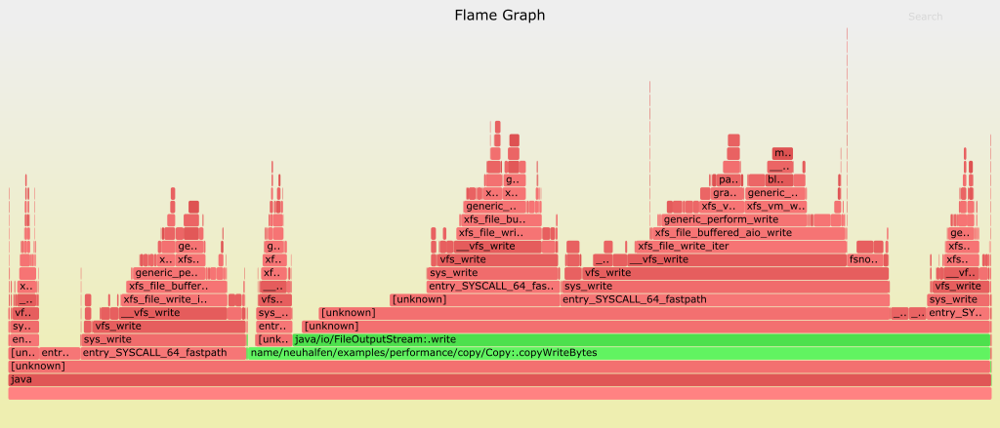
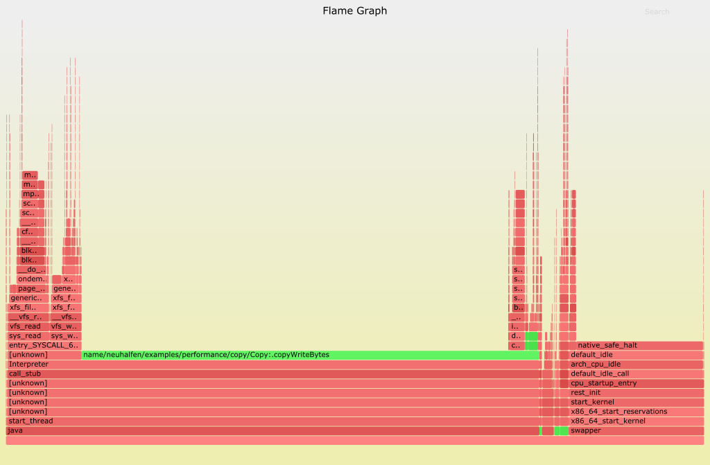
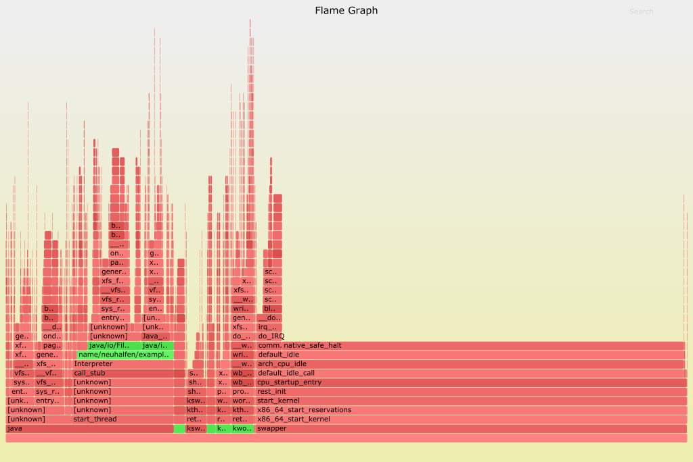

The following flame chartes where captured on a Fedora 23 VM Ware Fusion running on a MacBook Pro. Sampling started 10 seconds after the java process was launched and lasted 20 seconds. Java bytecode is tinted green. Everything else (including kernel) red.

*TODO*: Rerun the samples with `-XX:+PreserveFramePointer` enabled to get better callstacks

## Unbuffered

This chart had been recorded in _unbuffered_ mode. It is very easy to see, that most time is spent in a native function called by `FileOutputStream::write`. 

## Buffered

This chart had been recorded in _buffered_ mode. 

## Copy in blocks

This chart had been recorded in _blocks_ mode. 
